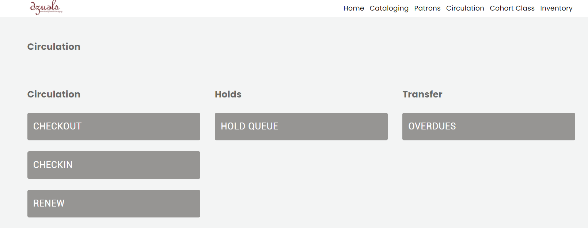

# DzuelsFoundation Library Management System


DzuelsFoundation is a comprehensive library management system that simplifies the process of cataloging, circulation, and patron management in a library setting. The project provides functionalities for managing books, patrons, staff, students, teachers, and guests. It also includes features for student attendance tracking and inventory management of library facilities. The system allows administrators and librarians to efficiently add, edit, and delete books, patrons, and other entities in the library database.

## Features

- **Cataloging**: Users can easily add new books to the library system, edit book details, and retrieve information about individual books or all books in the library collection.

- **Circulation**: The system supports essential circulation operations such as book checkout, check-in, and renewals, ensuring efficient management of borrowed books.

- **Patron Management**: DzuelsFoundation enables library staff to manage patrons' records, including adding new patrons, editing patron details, and deleting patron information if needed. It also allows patrons to be categorized as staff, students, teachers, or guests.

- **User Roles**: The project implements various user roles, such as admin, librarian, and ima (ima means mother. Our company director), to control access and permissions for different functionalities.

- **Student Attendance**: The system facilitates tracking student attendance, which can be a valuable feature for educational institutions using the library.

- **Inventory Management**: DzuelsFoundation provides functionality for keeping an inventory of library facilities, allowing administrators to manage and track the library's physical assets.



## Getting Started

Follow the instructions below to set up and run the DzuelsFoundation library management system on your local machine.

1. Clone the repository:http://localhost:3000/api/patrons

```
git clone https://github.com/Tolufolorunso/dzuelsFoundation.git
```

2. Install the dependencies:

```
cd dzuelsFoundation
npm install
```

3. Start the development server:

```
npm run dev
```

4. Open your browser and navigate to `http://localhost:3000` to access the application.

## Contributing

Contributions to DzuelsFoundation are welcome! If you find any issues or want to add new features, please feel free to submit a pull request.

## License

DzuelsFoundation is open-source software released under the [MIT License](LICENSE).

---
